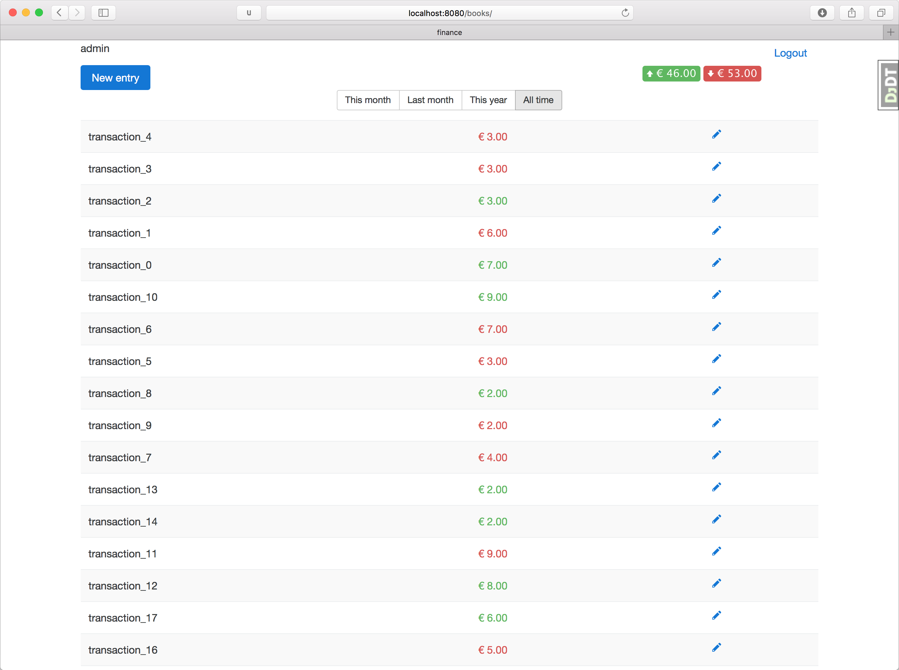

finance
=======

Small django app to track your income and expenses: `finantious.com <http://finantious.com>`__.

Screenshot of how app looks in dev environment

TODOs
-----------------

- Editable user profile
  - Password reset feature
  - custom currencies

- Income/Expense graph

- Probably need to undo django app approach, at least for now.
  - I learned that refactoring into apps must be done only when you know what are main app domains in the whole project, not when the project is just starting.

- Better build environment
  - Buildout?

- Gave option to track debts and loans

- clone transactions (e.g. lunch)

- Do some statistics (maybe d3.js graphs?)
  - how to categorize transactions?

Development
-----------

To develop Vagrant box with Ubuntu is used. To set up::

   vagrant up && vagrant ssh
   cd /vagrant
   make dev  # installs with dev dependencies, otherwise `make` is enough
   make migrate
   make run

Deployment
----------

Read `deployments/README.rst <deployments/README.rst>`__.
